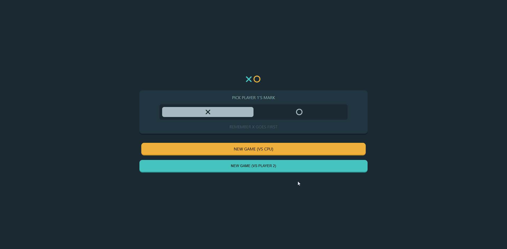

# 🏆 Ta-Te-Ti con IA Mejorada

Un clásico juego de **Ta-Te-Ti (Tic-Tac-Toe)** con modo **1 vs 1 local** y **modo contra IA** con dos niveles de dificultad. 🚀

## 🎮 Jugar ahora

👉 **[Jugar en GitHub Pages](https://andrew-mtz.github.io/TicTacToe/)**

## ✨ Características

- 🧑‍🤝‍🧑 **Modo 2 jugadores en local.**
- 🤖 **Modo IA con dos niveles de dificultad:**
  - 🟢 **Fácil:** Ahora sí puedes ganarle a la IA.
  - 🔴 **Difícil:** La IA juega estratégicamente y solo puedes empatar.
- 🛠 **Usa React con Providers** para gestionar la configuración del juego.
- ⚡ **Optimizado con pnpm** en lugar de npm para mayor velocidad.

### 🎮 Vista previa del juego

## 🤖 IA del juego

La IA usa un **algoritmo de poda** en lugar de Minimax para mejorar su rendimiento.

- En **modo fácil**, tiene errores intencionales para que el jugador pueda ganar.
- En **modo difícil**, la IA juega de forma óptima y solo puedes empatar.

## 🛠 Tecnologías usadas

- **React**
- **pnpm**
- **Context API (Provider)**
- **Algoritmo de poda para la IA**

## 📌 Próximas mejoras

- Agregar un contador de victorias/derrotas.
- Mejorar la UI con animaciones.
- Agregar sonidos de efecto al jugar.

## 🎮 Contribuciones

Si quieres mejorar este proyecto, ¡haz un fork y envía un pull request! 🚀
